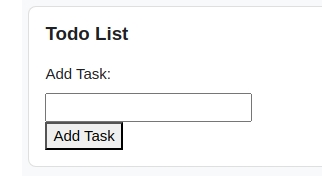
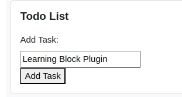
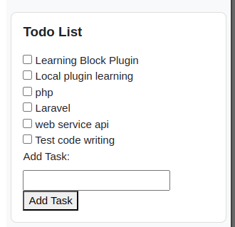
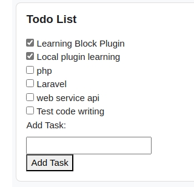
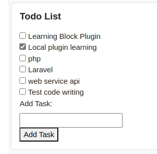

# Check List Block Plugin

**Check List** is basically a [Block Plugin](https://moodledev.io/docs/4.4/apis/plugintypes/blocks) for Moodle LMS. The main features of this plugin is to add todo list items and can be marked and unmarked upon completion of work.

# Key Features
### After adding this block plugin for the first time, the Todo list will be empty

### Task can be added and saved in databse through 'Add Task' button, click 'Add Task'

### User can psee their Todo list

### Users can mark their task after completing themSSS

### If Users mistakenly mark their task, they can unmark that again 

# How to install the plugin
### Step-1: Download the plugin
- Download the Zip of the plugin from Github
- Must rename the filename as `check_list.zip`*
### Step-2: Log into the Moodle site as Admin
### Step-3: Install the plugin
- Go to ``Home > Site Administration > Plugins > Install Plugins`` Select plugin zip file and install
### Step-4: Enable external web services
- Enable web services in the Moodle site :
    - Go to ``Home > Site administration > Server > Web services > Overview``.
    - Enable web services by changing status to Yes
    - Enable protocol by selecting rest
- Enable 'External services' : 
    - ``Home > Site Administration > Server > Web services > External services``
    - Edit ``Built-in services`` and enable it
    - Check **block_check_list_webservice** function in ``Functions``.
### Step-5: Add the block
- Toggle the ``Edit mode`` button and go to ``Home > My courses`` and select your course. If you didn't create any course, please create a course first.
- Click ``Add a block`` button and select the ``Todo list`` block plugin.
- Configure the plugin from plugin settings and select ``Where this block appears``.
- Select ``Display on page types`` and choose ``Any page`` option. 
- Enjoy the plugin experience.
